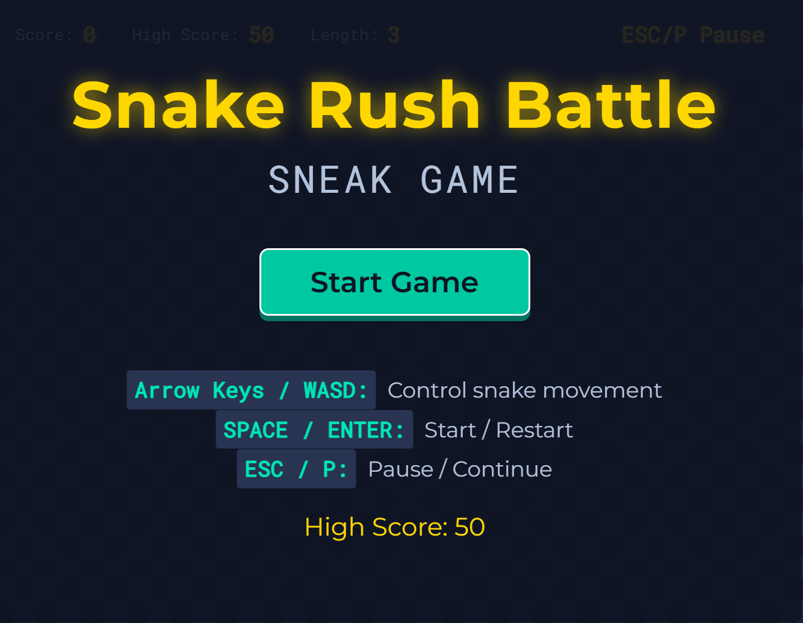
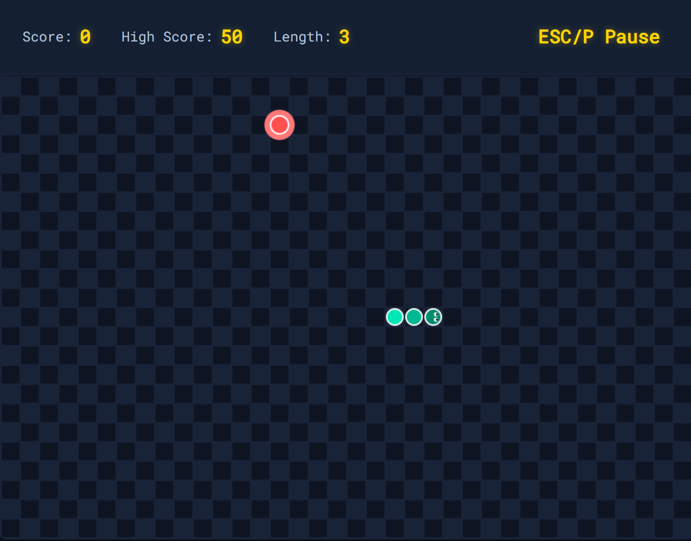

# 贪吃蛇大作战 - 网页版

一款基于现代 Web 技术开发的贪吃蛇游戏，由原 Pygame 实现版本迁移而来。

<table>
  <tr>
    <td></td>
    <td></td>
  </tr>
</table>

## 功能特点

- 完整游戏流程：菜单、游玩、暂停、游戏结束状态切换
- 流畅动画效果：渐变蛇身、脉冲食物特效
- 使用 localStorage 持久化保存最高分
- 响应式操控：支持键盘与鼠标交互
- 酷炫深色主题，搭配网格背景

## 如何游玩

**控制方式：**
- 方向键 / WASD：控制蛇移动
- 空格键 / ENTER：开始 / 重新开始游戏
- ESC / P：暂停 / 继续游戏

**游戏目标：**
操控蛇吃掉红色食物。每个食物增加 10 分。避免撞墙或撞到自己的身体。

## 文件说明

- `index.html` - 游戏主页面
- `style.css` - 样式与布局
- `game.js` - 游戏逻辑与渲染
- `tanchishe.py` - 原 Pygame 版本（仅供参考）

## 运行游戏

直接在任意现代浏览器中打开 `index.html` 即可。无需服务器或安装。

游戏使用 Canvas 2D 进行渲染，支持离线运行。

## 开发说明

本网页版由 Pygame 贪吃蛇游戏转换而来。转换过程保留了原始游戏机制、视觉风格以及中文字体美学。

## 许可协议

开源项目。欢迎自由修改与分发。
